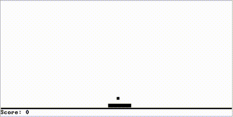

# nand2tetris in Rust

<p align="center">
  
  <br>
  <em>Project 11 Pong running in the VM Emulator</em>
</p>

A Rust implementation of the [nand2tetris](https://www.nand2tetris.org/) software toolchain: a Hack assembler, a VM-to-assembly translator, a Jack tokenizer, and a Jack-to-VM compiler. The hardware track (projects 00–05) follows the course's own HDL/simulator tooling in `tools/`.

Small experiments:

1. **Write it in a purely functional style** — no mutation, no loops, persistent immutable data structures
2. **Build one parser combinator library and see how far it actually reaches** — from flat, single-line grammars (assembly mnemonics, VM commands) up to Jack's genuinely recursive grammar (nested expressions, nested blocks).
3. **Do both of the above in Rust**, not as a port of how you'd write it in functional programming languages.

## Highlights

- **No mutation, anywhere in the public API.** Collection's every operation returns a new version, the old one is still valid. State is threaded explicitly through `fold`/`try_fold` accumulators or plain recursion instead.
- **An `IO` monad for effects.** File reads and writes are deferred (`IO::Suspend`) until `.unsafe_run()` is called once, at the edge of `main()`.
- **One parser combinator library, two input types.** `lib/parser`'s `Parser` trait is generic over both the input type and the error type. The Jack compiler's parser (`projects/compiler/src/parser.rs`) reuses the exact same `pair`/`either`/`map`/`zero_or_more` combinators against a token stream instead.
- **Correctness over convenience in error handling.** A malformed `.asm`/`.vm`/`.jack` file gets a message naming the file, the line, and what was expected, not a Rust panic.
- **Recursion has a bounded cost.** The persistent structures needed a 16MB-stack worker thread per CLI invocation because deep recursion (parsing, and the default `Drop` glue for a long `Rc`-chained list) can run past the default stack.


## Repository layout

```
lib/
  parser/       parser combinator library (generic over input type and error type)
  collections/  persistent data structures
  functional/   Functor trait + IO monad
  tokenizer/    Jack tokenizer (shared by analyzer and compiler)
  cli/          the command-line shell shared by all four tools
projects/
  asm/          Hack assembler        .asm  -> .hack
  vm/           VM translator         .vm   -> .asm
  analyzer/     Jack tokenizer        .jack -> T.xml   (project 10, part 1)
  compiler/     Jack compiler         .jack -> .vm     (project 10 part 2 + project 11)
  playground/   scratch space for your own Jack programs — see playground/README.md
  00.../11/     the official numbered course exercises and their fixtures
run-jack.sh     .jack -> .vm -> .asm -> .hack in one command
```

## Usage

Build and test everything:

```
cargo build --workspace
cargo test --workspace
```

Run a single tool directly:

```
cargo run -p asm -- path/to/Program.asm
cargo run -p vm -- path/to/vm-folder
cargo run -p analyzer -- path/to/jack-folder
cargo run -p compiler -- path/to/jack-folder
```

Or compile and run your own Jack program end to end — write it under `projects/playground/`, then:

```
./run-jack.sh projects/playground/foo
```

This compiles your `.jack` files, stages them alongside the OS's compiled `.vm` files (`tools/OS/`, since the bootstrap always calls `Sys.init`) when `tools/OS/` exists, translates and assembles the combination, and leaves a runnable `.hack` in `projects/playground/foo/build/`. Load it in `tools/CPUEmulator.sh`, or run the `.vm` output directly in `tools/VMEmulator.sh` for faster iteration without the assembler step.
